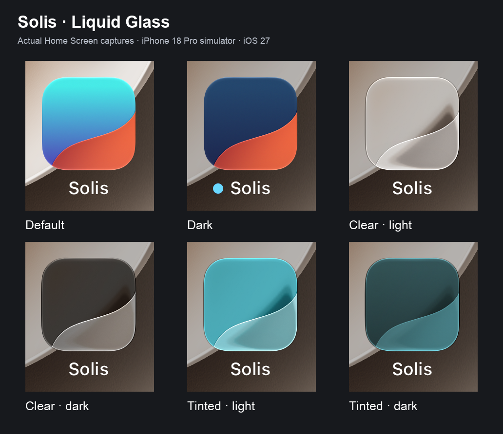

# Solis icon

Open `Solis.icon` in Icon Composer to edit the sky gradient and glass horizon. The app target uses this layered document as its primary icon. The original `solis-icon.svg` and PNG asset catalogue remain available.

The dark appearance uses a slate-blue to indigo sky gradient.

The horizon keeps the original curve. Its colour, translucency, and shadow are editable in Icon Composer; highlights come from the native renderer.

## Simulator captures

Built and installed on an iPhone 18 Pro simulator running iOS 27. The comparison contains crops of actual Home Screen screenshots, with no changes to the icon pixels.

- [Default](icon-previews/simulator-default.png)
- [Dark](icon-previews/simulator-dark.png)
- [Clear, light](icon-previews/simulator-clear.png)
- [Clear, dark](icon-previews/simulator-clear-dark.png)
- [Tinted, light](icon-previews/simulator-tinted-light.png)
- [Tinted, dark](icon-previews/simulator-tinted-dark.png)

`icon-previews/solis-default.png` is a full-size export from Icon Composer using design generation 26. The Home Screen screenshots use the simulator's iOS 27 renderer.
